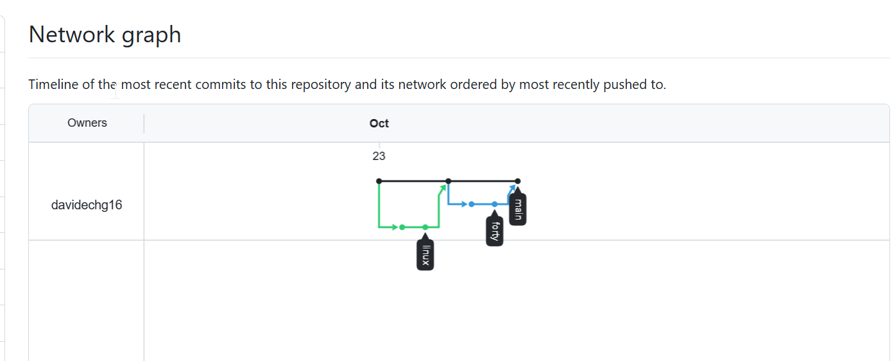

# Repositorio de ejercicios de clase

***Autor:***David Echevarría

**Descripción:**  Este repositorio contiene los ejercicios de repaso de Linux organizados por bloques, y el ejercicio *Forty* resuelto con comandos. Para cada uno, sus `.md`, `.assets` y `.pdf`.

***URL:*** https://github.com/davidechg16/repositorioEjercicios.git

