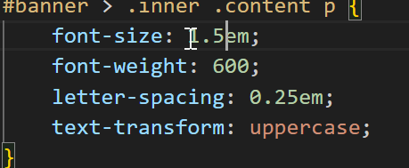
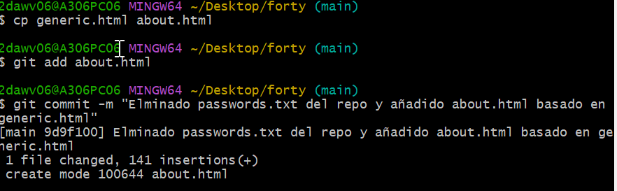
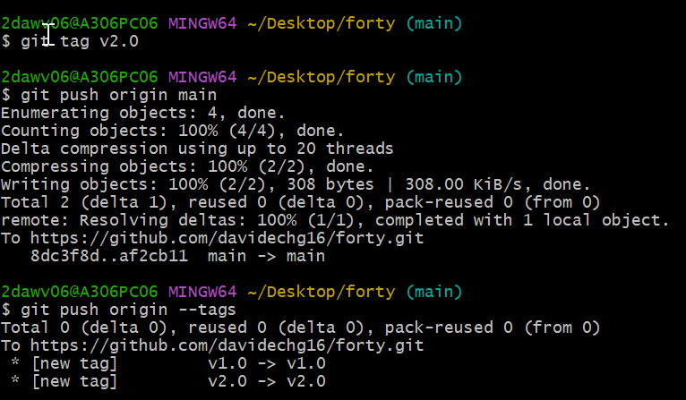

# EJERCICIO DE GIT - FORTY

## Trabajo en local


1. Inicializa un nuevo repositorio Git en una carpeta llamada **"forty"** y agrega los archivos proporcionados en el aula virtual.


2. Renombra la rama master a `main`

   Ya esta llamada `main`

   

3. Haz que los ficheros `README.txt` , `LICENSE.txt` y `passwords.txt` sean ignorados por el control de versiones.

   

   

   

   

4. Crea el archivo `passwords.txt` . Comprueba que el control de versiones lo ignora

   

5. Crea una rama llamada **"feature-content"** . Muévete a esa rama. Cambia, en la línea 3477, el **font-size** por **1.5em** en el archivo `main.css` . Ver los logs de la forma más gráfica posible.

   

   

   

   

6. Elimina el archivo **"passwords.txt"** en la carpeta `forty` . Verifica el estado del repositorio. ¿Hay cambios pendientes?

   

   

   

7. Crea un nuevo archivo llamado **" about.html "**, partiendo del archivo `generic.html` y agrégalo al repositorio.

   

8. Cambia a la rama `main` . Examina los logs del repositorio de forma gráfica.

   

9. Modifica algo en el archivo `generic.html` , comprueba que hay cambios, y realiza otro commit . Examina los logs del repositorio de forma gráfica.

   

   

   

10. Modifica algo en el fichero `elements.html` . Confirma los cambios, pero no hagas commit.

    

    

11. Mira las diferencias de `elements.html` . Los cambios no nos gustan, deshaz los cambios de `elements.html` . Comprueba que no hay cambios pendientes.

    

    

    

    

12. Muestra las diferencias entre la rama actual y la rama principal.

    

    

13. Fusiona la rama **"feature-content"** con la rama principal (main). Muestra los logs del repositorio de una forma gráfica y completa.

    ```bash
    git checkout main
    git merge --no-ff feature-content -m "Fusion feature-content con main"
    ```

    

14. Crea una nueva rama llamada **" hotfix "** y en ella, corrige un error crítico en el archivo `" index.html "`. (Por ejemplo, añade el enlace a la nueva página about.html)

    ```bash
    git checkout -b hotfix
    git add index.html
    git commit -m "Añadido enlace a about.html"
    ```

    

15. Fusiona la rama `"hotfix"` con la rama principal y verifica el historial de commits de forma que se vean todas las ramas gráficamente. ¿Borrarías la rama `hotfix` ? ¿En qué caso? ¿Cómo?

    ```bash
    git checkout main
    git merge --nol-ff hotfix -m "Merge hotfix into main"
    git log --graph --oneline --decorate --all
    ```

    Si, si no se necesita mas. 

    ```bash
    git branch -d hotfix 
    ```

    

16. Muestra el historial de cambios limitado a los últimos 3 commits.

    ```bash
    git log -n 3
    ```

    

17. Etiqueta el commit actual como "v1.0" y muestra las etiquetas existentes.

```bash
git tag v1.0
git show v1.0
git tag
```


## Trabajo en remoto

1. Sube al remoto los ficheros de tu repositorio local.


```bash
git remote add origin https://github.com/davidechg16/forty.git
git branch -M main
git push -u origin main
```


2. En local, crea una rama 'feature-head'. Cambia el título en la sección `head` de `index.html` , borra los comentarios del `head` , o previos, también. Confirma y sube los cambios al remoto.

   ```bash
   git checkout -b feature-head
   git add index.html
   git commit -m "Cambios hechos en index.html"
   git push -u origin feature-head
   ```

   

3. En **remoto**, crea una rama **'feature-articulo'**. Duplica la página `generic` , nómbrala como `articulo.html` , y añade como contenido un artículo sobre Git. Confirma los cambios y realiza un commit. Muestra los commits del repositorio tal como se ven en GitHub.

   

   

4. En el repositorio local examina los cambios. Actualiza el repositorio con el remoto. Fusiona en 'main' las dos ramas 'feature'. Crea la etiqueta 'v2.0'. Muestra los logs, commits, etiquetas y ramas actuales, en local y en remoto

   

   

   

   

5. En tu copia local, crea una rama `nueva` . En la rama nueva, cambia los enlaces de la página `index.html` para que apunten correctamente a la nueva página `articulo.html` . Confirma los cambios.

   

   

6. Muestra los logs de forma que se vean las ramas en tu copia local.

   

7. Te gusta el resultado de los cambios. Incorpora los cambios de la rama nueva a la principal.

   

8. Sube los cambios al remoto borrando la rama `nueva` , si es necesario. Comprueba primero con un comando en local, las ramas que hay en el repositorio remoto.

   ```bash
   git fetch origin
   git branch -r
   git push origin --delete actualizar-enlaces
   git branch -d actualizar-enlaces
   ```

   

9. Muestra en GitHub los cambios en el archivo `index.html` entre la versión actual y la anterior.

   

10. En el repositorio en GitHub, navega hasta el archivo `index.html` y selecciona la opción "History".

