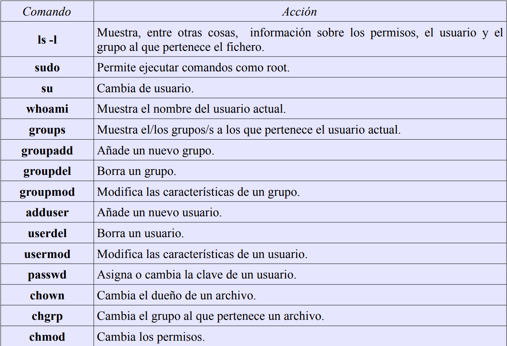

# Repaso de Linux

[TOC]

## Capitulo 2 - Ficheros y directorios

Directorios más importantes de un sistema Linux


## Comandos `pwd, ls, cd, mkdir`

### Comando `pwd`

Muestra cuál es el directorio de trabajo actual

```bash
$ pwd
```


### Comando `ls`

Muestra el contenido del directorio actual. Por defecto los archivos ocultos no se muestran.

```bash
$ ls
```


#### Comando `ls -a`

Comando que muestra todos los archivos, incluyendo los ocultos.

```bash
$ls -a
```


#### Comando `ls -l`

Muestra un listado detallado, con la última fecha de modificación de cada archivo, el tamaño, etc.

```bash
$ls -l
```


#### Comando `ls -h`

```bash
$ls -h
```


### Comando `cd`

Permite cambiar de directorio.

```bash
$ cd
```


### Comando `mkdir`

Comando usado para crear directorios.

```bash
$ mkdir nombreCarpeta
```


## Visualización de ficheros (`cat, more, less, head, tail`)

 Sirven para mostrar el contenido de ficheros de texto. La diferencia radica en cómo se muestra el contenido. A todos estos comandos hay que pasarles como argumento el fichero que se quiere mostrar. Se puede indicar una ruta, en caso de que el fichero que se quiere mostrar no esté en el directorio actual.

### Comando `cat`

Comando que muestra por pantalla el contenido de un fichero y, cuando termina, el usuario está otra vez de vuelta en la línea de comandos.

```bash
$ cat
$cat /var/log/dmesg
```

`cat /var/log/dmesg` muestra el contenido del fichero dmesg que está dentro del directorio `/var/log`.


### Comando `more`

Hace lo mismo que `cat`, a diferencia de que muestra el fichero pantalla a pantalla. Llena de texto la pantalla y espera a que el usuario pulse la tecla <espacio> para pasar a la siguiente.

```bash
$ more
$ more /var/log/dmesg
```


### Comando `less`

Es el más versátil de los tres, ya que permite moverse hacia delante y hacia atrás dentro del fichero.

```bash
$ less /var/log/dmesg
```


### Comandos `head` y `tail` 

Permiten mostrar de forma parcial el contenido de un fichero. `Head` muestra la cabezera y `tail` las últimas líneas.

```bash
$ head
$ head /boot/grub/menu.lst
```


```bash
$ tail
$ tail /boot/grub/menu.lst
```


## EDICIÓN DE FICHEROS (touch, vi, ee, mcedit)

El comando `touch` permite crear un fichero vacio.

```bash
$ touch 
```


El programa `ee` es un editor muy rudimentario pero al mismo tiempo efectivo. Podemos editar el archivo anterior y escribir alguna frase

```bash
$ee nombreDocumento.txt
```


Presionando la tecla ESC, el usuario puede salir al menú principal y guardar el fichero. Podemos comprobar ahora cuál es el contenido del fichero

```
$ cat nombreDocumento.txt
```


Otro editor simple es `nano`. Si no esta instalado alguno de estos editores, tecleamos `$sudo apt-get install` seguido del nombre del programa.

```bash
$ sudo apt-get install e
```


El programa `mcedit` es una parte de `mc`. Instalaremos `mc`

```bash
$ sudo apt-get install mc
$ mcedit nombreDocumento.txt
```


Editor de Linux por excelencia: `vi`

```bash
$ vi nombreDoc.txt
```


## Ejercicios del capitulo 2

1.  ¿En qué directorio se encuentran los ficheros de configuración del sistema? 

   En el directorio `/etc`

2. Para entrar en un sistema Linux hace falta a) nombre de usuario, contraseña y dirección IP, b) nombre de usuario y contraseña o c) únicamente una contraseña.

   b) nombre de usuario y contraseña

3. Muestra el contenido del directorio actual. 

   ```bash
   $ ls
   ```

   

4. Muestra el contenido del directorio que está justo a un nivel superior. 

   ```bash
   $ ls ..
   ```

   

5. ¿En qué día de la semana naciste?, utiliza la instrucción `cal` para averiguarlo.

   ```bash
   $ cal julio 2002
   ```

   

   

6. Muestra los archivos del directorio `/bin`

    ```bash
    ls /bin
    ```

    

7. Suponiendo que te encuentras en tu directorio personal (`/home/nombre`), muestra un listado del contenido de `/usr/bin` 

    a) con una sola línea de comando, b) moviéndote paso a paso por los directorios y c) con dos líneas de comandos.

    

 a)   

```
ls /bin
```

b) 

```bash
$ cd ..
cd usr
cd bin
```

c) 

```bash
ls /usr/bin
```


8. Muestra todos los archivos que hay en `/etc` y todos los que hay dentro de cada subdirectorio, de forma recursiva (con un solo comando).

   

   ```bash
   $ ls -R /etc
   ```

   

9. Muestra todos los archivos del directorio `/usr/X11R6/bin` ordenados por tamaño (de mayor a menor). Sólo debe aparecer el nombre de cada fichero, sin ninguna otra información adicional.

   

   

   ```bash
   $ ls -S /usr/X11R6/bin
   ```

   

10. Muestra todos los archivos del directorio `/etc` ordenados por tamaño (de mayor a menor) junto con el resto de características, es decir, permisos, tamaño, fechas de la última modificación, etc. El tamaño de cada fichero debe aparecer en un formato “legible”, o sea, expresado en Kb, Mb, etc.

​    

```bash
$ ls -Slh /etc
```


11. Muestra todos los archivos del directorio `/bin` ordenados por tamaño (de menor a mayor). Sólo debe aparecer el tamaño y el nombre de cada fichero, sin ninguna otra información adicional. El tamaño de cada fichero debe aparecer en un formato “legible”, o sea, expresado en Kb, Mb, etc.

    

    ```bash
    $ ls -Sshr /bin
    ```

    

12. Muestra el contenido del directorio raíz utilizando como argumento de `ls` una ruta absoluta.

    

    ```bash
    $ ls /
    ```

    

13. Muestra el contenido del directorio raíz utilizando como argumento de `ls` una ruta relativa. Suponemos que el directorio actual es `/home/elena/documentos`.

    

    ```bash
    $ ls ../../..
    ```

    

14. Crea el directorio gastos dentro del directorio personal

    

    ```bash
    $ mkdir gastos
    ```

    

15. ¿Qué sucede si se intenta crear un directorio dentro de `/etc`

    Solo podria hacerlo un usuario root.

    

16. Muestra el contenido del fichero `/etc/fstab`

    

    ```bash
    $ cat /etc/bash.bashrc
    ```

    

17. Muestra las 10 primeras líneas del fichero `/etc/bash.bashrc`

18. 

    ```bash
    $ head /etc/bash.bashrc
    ```

    

19. Crea la siguiente estructura de directorios dentro del directorio de trabajo personal:


```bash
~$ mkdir multimedia
~$ cd multimedia/
~/multimedia$ mkdir musica imagenes video presentaciones
~/multimedia$ cd imagenes/
~/multimedia/imagenes$ mkdir personales otras
```


19. Crea un fichero vacío dentro del directorio musica, con nombre `estilos_favoritos.txt`

    

    ```bash
    $ cd
    $ cd multimedia/musica
    $ touch estilos_favoritos.txt
    ```

    

20. Utiliza tu editor preferido para abrir el fichero `estilos_favoritos.txt` e introduce los estilos de música que más te gusten. Guarda los cambios y sal.

    ```bash
    $ vi favoritos.txt
    $ i
    $ techno
    $ groove
    $ hardbounce
    $ ESC:w
    $ :q
    ```

    

21. Muestra todo el contenido de `estilos_favoritos.txt`

​    

```bash
$ cat estilos_favoritos.txt
```


22. Muestra las 3 primeras líneas de `estilos_favoritos.txt`

    ```bash
    $ head -n3 estilos.favoritos.txt
    ```

    

23. Muestra la última línea de `estilos_favoritos.txt`

    ```bash
    $ tail -n1 estilos_favoritos.txt
    ```

    

24. Muestra todo el contenido del fichero `estilos_favoritos.txt` excepto la primera línea. Se supone que no sabemos de antemano el número de líneas del fichero.

```bash
$ tail -n+2 estilos_favoritos.txt
```


## CAPÍTULO 3

### Caracteres comodín

Muchas veces necesitamos realizar acciones sobre muchos archivos o directorios al mismo tiempo:

```bash
$ cat docu1 docu2 docu3 docu4 docu5 docu6
```


Para mostrar cada uno de los ficheros que comienzan por docu seguido de un numero del uno al seis se puede usar un patrón:

```bash
$ cat fich[1-6]
```


Para mostrar solo el contenido de todos los ficheros que empiezan por fich se hace:

```bash
$ cat fich*
```


Para mostrar todos los ficheros que empiezan por la letra a y terminan por las letras dentro del directorio `/usr/bin` 

```bash
$ ls /usr/bin/a*s
```


`?` representa un caracter cualquiera. La siguiente sentencia muestra todos los ficheros del directorio `/usr/bin` cuyo nombre empieza por `g`, sigue cualquier caracter, a continuación sigue una `o` y acaba con cualquier cadena de caracteres.

```bash
$ ls /usr/bin/g?o*
```


### Copia y borrado de ficheros (cp, mv, rm)

El comando `cp` sirve para copiar ficheros. Se puede copiar uno o muchos.

```bash
$ cp /etc/hosts /home/alumno/pruebas/
```


Si no se especifica ningun directorio origen, se toma por defecto el directorio actual.

```bash
$ cp *.odt textos/
```


Cuando se quiere especificar como directorio destino el directorio actual se usa el caracter *.*

```bash
$ cp /usr/bin/g*
```


El comando `mv` sirve para mover y para cambiar de nombre.

```
$ mi_texto.txt carta.txt
```

le cambia el nombre a `mi_texto.txt` y pasa a llamarse `carta.txt`

En cambio

```bash
$ mv carta.txt Documentos/
```

mueve `carta.txt` al directorio **Documentos**

Se pueden hacer las dos cosas a la vez:

```bash
$ cd Documentos/
/ Documentos$ mkdir correspondencia
/Documentos$ mv carta.txt correspondencia/carta01.txt
```

El comando `rm` se usa para borrar ficheros. Es importante destacar que estos ficheros no se envían a una papelera así que **NO SE PUEDEN RECUPERAR AL BORRARSE**

```bash
$ rm *.txt
```

### Copia y borrado de directorios(cp, mv, rm)

Un directorio puede contener muchos ficheros y, otros directorios con mas ficheros y directorios. Para copiar un fichero completo hay que indicarlo con la opcion `-R`. A esto se le suele llamar ***copiar de forma recursiva***

```bash
$ mkdir multimedia2
$ cp multimedia/* multimedia2
cp: se omite el directorio «multimedia/imagenes»
cp: se omite el directorio «multimedia/musica»
cp: se omite el directorio «multimedia/presentaciones»
cp: se omite el directorio «multimedia/video»
~$ ls multimedia2


```

Se hizo una copia del contenido del directorio `multimedia` al `multimedia2` pero sin añadir todo lo que viene dentro porque no se hizo la ***copia recursiva***.

Ahora vamos a hacerlo de forma ***recursiva***:

```bash
$ cp -R multimedia/* multimedia2
$ls -R multimedia2
multimedia2:
imagenes musica presentaciones video

multimedia2/imagenes:
otras personales

multimedia2/imagenes/otras:

multimedia2/imagenes/personales:

multimedia2/musica:
estilos_favoritos.txt

multimedia2/presentaciones:

multimedia/video:
```

Hemos copiado tanto la estructura de directorios como los contenidos de cada uno de ellos.

El comando `mv` funciona de forma parecida a `cp` , pero mueve en vez de copiar. Para renombrar funciona igual que con los ficheros.

```bash
$ mv multimedia2 multimedia_copia
```

Cambia el nombre de `multimedia2` a `multimedia_copia`

Con `rm` se pueden borrar directorios pero tiene que ser de forma recursiva

```bash
$ rm -Rf multimedia_copia/
```

Hemos añadido la opción -f que hace que no se nos pida confirmacion por cada elemento que se quiere borrar.

### Ejercicios Capítulo 3

1. Muestra todos los archivos del directorio actual que son imágenes jpg. 

   ```bash
   $ ls *.jpg
   ```

   

2. . Muestra todos los archivos del directorio /usr/bin que empiecen por la letra j. 

   ```bash
   $ ls /usr/bin/j*
   ```

   

3. Muestra los archivos que empiecen por k y tengan una a en la tercera posición, dentro del directorio /usr/bin. 

   ```bash
   $ls /usr/bin/k?a*
   ```

   

4. Muestra los archivos del directorio /bin que terminen en n. 

   ```bash
   $ls /bin/*n
   ```

   

5. Muestra todos los archivos que hay en /etc y todos los que hay dentro de cada subdirectorio, de forma recursiva. 

   ```bash
   $ls -R /etc
   ```

   

6. Crea un directorio en tu directorio de trabajo con nombre prueba. Copia el archivo gzip del directorio /bin al directorio prueba. Crea un duplicado de gzip con nombre gzip2 dentro de prueba. 

   ```bash
   ~$ mkdir prueba
   ~$ cp /bin/gzip prueba
   ~$ cd prueba/
   ~/prueba$ cp gzip gzip2
   ```

   

7. Cambia el nombre de prueba a prueba2. Crea prueba3 en el mismo nivel que prueba2 y mueve todos los ficheros de prueba2 a prueba3. Borra prueba2. 

   ```bash
   ~$prueba$ cd ..
   ~$ mv prueba prueba2
   ~$ mkdir prueba3
   ~$ mv prueba2/* prueba3/
   ~$ rmdir prueba2 
   ```

   

8. Crea un fichero vacío con nombre “*?Hola caracola?*”. ¿Se puede? En caso de que se pudiera, ¿sería recomendable poner nombres así? Razona la respuesta. 

   Si usando `\` para indicar caracteres especiales

   No se deberia de usar caracteres raros.

   

9. Crea un directorio con nombre multimedia_pruebas y copia en él todo el contenido del directorio multimedia. A continuación crea en multimedia/video/ dos ficheros, uno con nombre peliculas.txt y otro con nombre actores.txt. Edita el fichero peliculas.txt e introduce el nombre de tu película favorita. A continuación, crea en multimedia_pruebas/video/ otro fichero que también tenga por nombre peliculas.txt, edítalo y esta vez escribe el nombre de tus cinco películas favoritas. Ahora haz una copia de todo el contenido de multimedia en multimedia_prueba de tal forma que sólo se copien los contenidos nuevos, es decir, si hay coincidencia en el nombre de un archivo se respetará el que se haya modificado más recientemente. Para comprobar que se ha hecho todo correctamente, basta mirar si en multimedia_prueba/video está el archivo vacío actores.txt y además el archivo peliculas.txt debe contener 5 películas y no 1.

   ```bash
   ~$ mkdir multimedia_pruebas
   ~$ cp -R multimedia/* multimedia_pruebas/
   ~$ cd multimedia /video/
   ~/multimedia/video$ touch peliculas.txt actores.txt
   ~/multimedia/video$ vi peliculas.txt
   ~/multimedia/video$ cd
   ~$ cd multimedia_pruebas/video/
   ~/multimedia_pruebas/video$ vi peliculas.txt
   ~/multimedia_pruebas/video$ cd
   ~$ cp -Ru multimedia/* multimedia_pruebas/
   ```

   

10. Borra el directorio multimedia/imagenes/otras. El sistema debe pedir al usuario que confirme el borrado. 

    ```bash
    $ rm -Ri multimedia/imagenes/otras/
    ```

    

11. Mueve el archivo peliculas.txt, que está dentro de multimedia/video, al directorio que está justo a un nivel superior. Ahora el archivo debe llamarse mis_peliculas.txt en lugar de películas.

```bash
~$ cd multimedia/video/
~/multimedia/video$ mv peliculas.txt ../mis_peliculas.txt
```


## Capítulo 4, Grupos, usuarios y permisos

El ***SUPERUSUARIO***, administrador del sistema o el `root` es un usuario que tiene privilegios para cambiar la configuración, borrar y crear ficheros en cualquier directorio, crear nuevos grupos y usuarios, etc. Hay que ser responsable al trabajar como ***SUPERUSUARIO***

Hacer un `root`:

```bash
$ touch /etc/prueba.txt
touch: no se puede efectuar `touch' sobre «/etc/prueba.txt»: Permiso denegado
$ sudo touch /etc/prueba.txt
$ ls /etc/pru*
/etc/prueba.txt
```


Lo de permiso denegado es porque un usuario sin privilegios no puede hacer eso.

### Permisos

Para conocer información sobre grupos, usuarios y permisos, usamos el comando `ls` junto con la opcion -l. Veamos los permisos del fichero `whatis` que está en el directorio `/usr/bin`

```
$ ls -l /usr/bin/whatis
-rwxr-xr-x 1 root root 87792 2008-03-12 14:24 /usr/bin/whatis 
```


En la primera columna estan los ***permisos***, en la tercera el ***usuario*** y en la cuarta el nombre del ***grupo***


***Tipo de fichero***


### ¿Quienes somos?(whoami, groups)

Podemos usar `su` para ejecutar comandos como otro user distinto, siempre que sepamos la contraseña.

```bash
$ whoami
luisjose
$ su alumno
Contraseña:
$ whoami
alumno 
```


Para volver a ser el user original, solo hay que pulsar `exit`

```bash
$ whoami
alumno
$ exit
exit
$ whoami
luisjose 
```

Con el comando `groups` se puede ver a qué grupo pertecemos.

```bash
luisjose@luisjose-xps1330:~$ groups
luisjose adm dialout cdrom floppy audio dip video plugdev scanner lpadmin admin
netdev powerdev sambashare
```

Se pueden especificar uno o mas usuarios detras de `groups`. Eso nos dirá a que grupo pertenece cada uno de ellos.

```bash
luisjose@luisjose-xps1330:~$ groups alumno root
alumno : alumno
root : root
```

### Gestión de grupos (groupadd, groupdel, groupmod)

Esos comandos permiten crear, borrar y modificar grupos respectivamente.

Crearemos los grupos oficina_malaga, oficina_jaen y oficina_madrid

```bash
$ groupadd oficina_malaga
groupadd: incapaz de bloquear el fichero de grupos
$ sudo groupadd oficina_malaga
$ sudo groupadd oficina_jaen
$ sudo groupadd oficina_madrid 
```


Para corregir un error de escritura, usaremos `groupmod`. Por ejemplo:

```bash
$ sudo groupmod -n oficina_madrid oficina madrit
```

Para borrar un grupo usaremos `groupdel`

```
$ sudo groupdel oficina_jaen
```


### Gestion de usuarios (adduser, userdel, usermod)

La gestión de usuarios, exige que los comandos se ejecuten con los privilegios del administrador del sistema. Se puede escribir    `sudo` antes de cada comando, o se puede hacer lo siguiente:

```
$ sudo bash
```

Ahora se muestra un carácter “#” en lugar de un “$”. A partir de ahora, todos los comandos se ejecutarán con privilegios de administrador del sistema. Hay que acordarse de volver al usuario inicial mediante `exit`

Daremos de alta dos usuarios en la de malaga, uno en la de madrid y otro que irá y volverá de una  a otra.

```bash
# adduser pedro --ingroup oficina_malaga
# adduser ana --ingroup oficina_malaga

# adduser berta --ingroup oficina_madrid
# adduser laura --ingroup oficina_malaga
# adduser laura oficina_madrid
```

Hemos creado los usuarios y a su vez, los hemos incluido dentro de los grupos correspondientes.

Es importante destacar que hemos `adduser` y no `useradd`. Este último es considerado un comando de bajo nivel y se recomienda usar el primero.

Recordar salir del modo `root` con el comando `exit` cuando no haya que hacer tareas con privilegios de administracion.

```bash
# exit
```

De ahora en adelante, simplemente se indicará con el carácter `$` que se trabaja como usuario sin privilegios y con el carácter `#` que se trabaja como root.

Para cada usuario se crea un directorio dentro de `/home`. Es el directorio de trabajo:

```bash
$ls /home/
alumno ana berta ftp laura luisjose pedro
```


### Cambio de grupo y de dueño (chown, chgrp)

Imaginemos que el fichero `informe.txt` ha sido creado por el usuario `pedro`. Por defecto, el dueño de un archivo es el usuario que lo crea, en este caso `pedro`. El grupo del usuario `pedro`, como hemos visto antes es `oficina_malaga`.

```bash
$ su pedro
$ cd
$ pwd
/home/pedro
$ touch informe.txt
$ ls -l
-rw-r--r-- 1 pedro oficina_malaga 0 2009-03-19 12:46 informe.txt 
```

Todo esto se puede cambiar. Moveremos el fichero al directorio de trabajo del usuario `laura` y le cambiaremos el dueño.

```bash
# mv informe.txt /home/laura/
# cd /home/laura/
# chown laura informe.txt
# ls -l
-rw-r--r-- 1 laura oficina_malaga 0 2009-03-19 12:46 informe.txt
```

Ahora el fichero tiene al usuario `laura` como propietario.

Tanto `chown` como `chgrp` se pueden usar con la opción -R para cambiar el duño o grupo en un directorio completo, de forma recursiva.

### Cambio de privilegios (chmod)

`chmod` sirve para cambiar los privilegios de uno o varios ficheros. Los mismos permisos que se pueden ver con `ls -l`

```bash
$ ls -l
-rw-r--r-- 1 pedro oficina_malaga 0 2009-03-19 15:38 hola_mundo.rb
$ chmod +x hola_mundo.rb
$ ls -l
-rwxr-xr-x 1 pedro oficina_malaga 0 2009-03-19 15:38 hola_mundo.rb 
```

hemos añadido el permiso de ejecución al fichero hola_mundo.rb. Ahora hay tres `x` la que corresponde al dueño del fichero, la de todos los usuarios que pertenecen al grupo y la del resto de usuarios.

Si no se especifica la letra, pertenece a los usuarios(u, g, ol). Se pueden indicar de forma explícita con el carácter a (all).


Quitaremos ahora el permiso de ejecucion para el resto de users(others) y daremos permiso de escritura(write) a los usuarios del mismo grupo(group).

```bash
$ ls -l
-rwxr-xr-x 1 pedro oficina_malaga 0 2009-03-19 15:38 hola_mundo.rb
$ chmod o-x hola_mundo.rb
$ chmod g+w hola_mundo.rb
$ ls -l
-rwxrwxr-- 1 pedro oficina_malaga 0 2009-03-19 15:38 hola_mundo.rb 

```

Método simbólico: método que usa los caracteres `rwx`.


Esta línea:

```bash
$ chmod 755 hola_mundo.rb
```

sería equivalente a estas tres

```bash
$ chmod u+rwx hola_mundo.rb
$ chmod g+rx-w hola_mundo.rb
$ chmod o+rx-w hola_mundo.rb
```

### Resumen capítulo 4



1. Completa la siguiente tabla: 

   | 654  | rw-r-xr-- |
   | ---- | --------- |
   | 766  | rwxrw-rw  |
   | 777  | rwxrwxrwx |
   | 520  | r-x-w---- |
   | 764  | rwxrw-r-- |
   | 440  | r--r----- |

   2. Crea los grupos oficina1 y oficina2. 

      ```bash
      # groupadd oficina1
      # groupadd oficina2
      ```

      

   3. Crea los usuarios paco y pablo. Estos usuarios deben pertenecer únicamente al grupo oficina1. 

      ```bash
      # adduser paco --ingroup oficina1
      # adduser pablo --ingroup oficina1
      ```

      

   4. Crea los usuarios alba y nerea. Estos usuarios deben pertenecer únicamente al grupo efficient. 

      ```bash
      # adduser alba --ingroup oficina2
      # adduser nerea --ingroup oficina2
      ```

      

   5. Como usuario paco Crea un fichero con nombre topsecret.txt en su directorio de trabajo al que únicamente él tenga acceso, tanto de lectura como de escritura. 

      ```bash
      $ su paco
      $ cd
      $ touch top_secret.txt
      $ chmod 600 top_secret.txt
      ```

      

   6. Crea otro fichero, también como usuario paco, con nombre ventas_trimestre.txt al que tengan acceso, tanto para leer como para escribir todos los usuarios que pertenezcan al mismo grupo. Se deben dejar los permisos que haya por defecto para el dueño y para el resto de usuarios. Comprueba como usuario pablo que puedes modificar el fichero. 

      ```bash
      $ touch ventas_trimestre.txt
      $ chmod g+rw ventas_trimestre.txt
      Comprobamos que el usuario pablo puede modificar este fichero, ya que es miembro del mismo
      grupo:
      $ exit
      $ su pablo
      $ vi /home/paco/ventas_trimestre.txt
      ```

      

   7. Como usuario alba, crea un fichero con nombre empleados.txt al que pueda acceder cualquier usuario para leer su contenido, y cualquier usuario del mismo grupo para leer o escribir. 

      ```bash
      $ exit
      $ su alba
      $ cd
      $ touch empleados.txt
      $ chmod 664 empleados.txt 
      ```

      

   8. Copia el fichero empleados.txt al directorio de trabajo de alumno (crea también el usuario alumno si no está creado). Cambia el propietario y el grupo al que pertenece el fichero, ahora debe ser alumno.

      ```bash
      $ exit 
      $ sudo cp /home/alba/empleados.txt /home/alumno/ 
      $ sudo chown alumno /home/alumno/empleados.txt 
      $ sudo chgrp alumno /home/alumno/empleados.txt
      ```

      

   9. Como usuario pablo, copia un programa del directorio /usr/bin al directorio de trabajo con un nombre diferente. Por ejemplo xclock se puede copiar como reloj. Mira los permisos de este programa. Comprueba que se puede ejecutar. Puede que sea necesario dar permiso para que otros usuarios distintos al actual puedan ejecutar aplicaciones en el entorno gráfico, basta con ejecutar como administrador: xhost +.

      ```bash
      luisjose@luisjose-xps1330:~$ su pablo
      Contraseña:
      pablo@luisjose-xps1330:/home/luisjose$ cd
      pablo@luisjose-xps1330:~$ cp /usr/bin/xclock reloj
      pablo@luisjose-xps1330:~$ ls -l
      total 32
      lrwxrwxrwx 1 pablo oficina1 26 2009-03-23 10:28 Examples -> /usr/share/example-content 
      -rwxr-xr-x 1 pablo oficina1 32568 2009-03-23 11:18 reloj
      pablo@luisjose-xps1330:~$ ./reloj
      No protocol specified
      Error: Can't open display: :0.0 
      ```

      

   10. Cambia los permisos de reloj de tal forma que sólo lo pueda ejecutar el propietario del archivo. 

       ```bash
       $ chmod go-x reloj
       ```

       

   11. Crea el usuario modesto, perteneciente a oficina2. Dentro de su directorio de trabajo, crea un directorio de nombre compartido_con_todos. 

       ```bash
       $ exit
       $ sudo adduser modesto --ingroup oficina2
       $ su modesto
       $ cd
       $ mkdir compartido_con_todos
       ```

       

   12. Cambia de usuario en el entorno gráfico (botón salir y botón cambiar de usuario) y entra como modesto. Crea con OpenOffice.org Calc los ficheros telefono_contactos.ods, gastos_marzo.ods y sueldos.ods. Inserta varias entradas en cada uno de los ficheros y grábalo todo en el directorio compartido_con_todos. 

   13. Da permiso de lectura a la carpeta compartido_con_todos y a todos los ficheros que contenga para todos los usuarios. 

       ```bash
       chmod -R a+r compartido_con_todos
       ```

       

   14. Restringe el acceso de escritura sobre el fichero telefono_contactos para que sólo lo puedan modificar los usuarios del grupo al que pertenece su propietario. 

       ```bash
       cd compartido_con_todos
       chmod g+w telefono_contactos.ods
       chmod o-w telefono_contactos.ods (en realidad esta línea sería redundante)
       ```

       

   15. Cambia los permisos de gastos_marzo para que sólo pueda modificarlo su propietario y leerlo cualquiera del mismo grupo. 

       ```bash
       chmod 640 gastos_marzo.ods
       ```

       

   16. Cambia los permisos de sueldos para que sólo su dueño tenga acceso a él, tanto para lectura como para escritura. 

       ```bash
       chmod 600 sueldos.ods
       ```

       

   17. Si un usuario tiene permiso de lectura sobre un fichero pero ese fichero se encuentra dentro de un directorio sobre el que no tiene permiso de lectura, ¿podrá leer el fichero?, haz la prueba.

​	No. Un usuario que no tenga -r no puede acceder a los ficheros de ese directorio.


# Comandos de Red en Linux

## 1. `ip a`

El comando `ip a` o `ip address` muestra la configuracion de las interfaces de red y las direcciones IP asociadas. Alternativa a `ipconfig`. Nos da detalles sobre el estado de las interfaces, direcciones IIP asignadas, máscaras de red, etc.

```bash
ip a
```

## 2. `ifconfig`

Muestra y configura las interfaces de red. Se está reemplazando por `ip`. Permite ver las direcciones IP asignadas y configurar las interfaces.

```bash
ifconfig
```

## 3. `ping`

Verifica la conectividad de red entre dos dispositivos mediante el envío de paquetes ICMP. Mide la latencia y pérdida de paquetes entre el host de origen y el destino.

```bash
ping [direccion IP o dominio]
```

## 4. `nslookup`

Se usa para realizar consultas DNS, lo que permite resolver nombres de dominio a direcciones IP o viceversa. Es útil para verificar la configuración DNS y disponibilidad de nombres de dominio.

```bash
nslookup [nombre de dominio o direccion IP]
```

## 5. `netstat`

Proporciona estadísticas detalladas sobre las conexiones de red, incluyendo las conexiones activas, tablas de enrutamiento y estadísticas de las interfaces. Es útil para diagnosticar problemas de red y monitorear el tráfico de red.

```bash
netstat
```

## 6. `curl`

Es una herramienta de línea de comandos para transferir datos usando varios protocolos, como HTTP, FTP, y más. Se usa frecuentemente para descargar archivos, hacer pruebas de APIs, y verificar la conectividad de servicios web.

```bash
curl [URL]
```

## 7. `hostname` 

Muestra o configura el nombre del host del sistema. Es útil para verificar el nombre de la máquina o cambiarlo temporalmente sin reiniciar el sistema.

```bash
hostname
```

## 8. `whois`

Realiza consultas sobre la información de registro de un dominio, incluyendo datos del propietario, fechas de creación y expiración, y los servidores DNS asociados. Es útil para obtener información detallada de dominios en internet. 

```bash
whois [nombre de dominio]
```

## 9. `ip route`

Sirve para ***ver, añadir, modificar y borrar rutas*** en la tabla de enrutamiento del kernel 

Se usa principalmente para: 

- Mostrar rutas configuradas.
- Definir rutas hacia redes y hosts.
- Configurar el gateway (ruta por defecto).
- Eliminar rutas.


1. Mostraremos la tabla de enrutamiento.

   ```bash
   ip route show
   ```

   Ejemplo de salida:

   ```bash
   default via 192.168.1.1 dev eth0 proto dhcp metric 100 192.168.1.0/24 dev eth0 proto kernel scope link src 192.168.1.50 metric 100
   ```

   Aquí vemos que la ruta por defecto (`default`) va a través de `192.168.1.1` en `eth0`.

   Y que la red local `192.168.1.0/24` está directamente conectada.

   2. Añadir una ruta a una red

      ```bash
      sudo ip route add 10.10.10.0/24 via 192.168.1.1 dev eth0
      ```

      Para llegar a la red `10.10.10.0/24`, se usará la puerta de enlace `192.168.1.1` a través de `eth0`.

   3. Añadir una ruta a un host específico.

      ```
      sudo ip route add 172.16.0.50 via 192.168.1.1
      ```

      Sólo el host `172.16.0.50` pasará por el gateway `192.168.1.1`

   4. Añadir la ruta por defecto(gateway)

      ```bash
      sudo ip route add default via 192.168.1.1 dev eth0
      ```

      Configura el gateway predeterminado para todo el tráfico no especificado.

   5. Eliminar una ruta

      ```bash
      sudo ip route del 10.10.10.0/24
      ```

   Elimina la ruta hacia la red `10.10.10.0/24`.

   6. Reeemplazar una ruta

      ```bash
      sudo ip route replace default via 192.168.1.254 dev eth0
      ```

      Si existe una ruta por defecto la sobrescribe; si no, la añade.

   7. Rutas avanzadas (por tabla de enrutamiento)

      ```bash
      ip route show table all
      ```

       Permite ver todas las tablas de enrutamiento, no sólo la principal (útil en ***policy routing***).

   ## 10. `ip link`

   Sirve para ***mostrar y gestionar interfaces de red*** en Linux (`eth0, whlan0, lo`, etc)

   Con él puedes: 

	-  Ver información detallada de las interfaces.
	-  Activar o desactivar una interfaz (UP/DOWN).
	-  Cambiar nombre a una interfaz.
	-  Cambiar dirección MAC.
	-  Ajustar parámetros avanzados de red.


### Ejemplos de uso

1. Mostrar todas las interfaces de red

   ```bash
   ip link show
   ```

   Salida típica: 

   ```bash
   1: lo: <LOOPBACK,UP,LOWER_UP> mtu 65536 qdisc noqueue state UNKNOWN mode DEFAULT
   group default qlen 1000    	
   		link/loopback 00:00:00:00:00:00 brd 00:00:00:00:00:002: 
   2: eth0: <BROADCAST,MULTICAST,UP,LOWER_UP> mtu 1500 qdisc fq_codel state UP mode 
   DEFAULT group default qlen 1000
   	link/ether 08:00:27:4a:35:9c brd ff:ff:ff:ff:ff:ff
   ```

   Te muestra ***ID de interfaz, nombre, estado, MTU, dirección MAC, etc***.

   2. Mostrar sólo una interfaz concreta.

      ```bash
      ip link show eth0
      ```

      Filtra la información de la interfaz ***eth0***

      3. Activar una interfaz

      ```bash
      sudo ip link set eth0 up
      ```

       Activa la tarjeta de red eth0.

      4. Desactivar una interfaz

      ```bash
      sudo ip link set eth0 down
      ```

      Desactiva la interfaz eth0 (útil para pruebas o evitar tráfico temporalmente).

      5. Cambiar el nombre de una interfaz

​	

```bash
sudo ip link set eth0 name lan0
```

​		Renombra la interfaz de `eth0` a `lan0`

​	

6. Cambiar la dirección MAC

   ```bash
   sudo ip link set dev eth0 address 02:1A:2B:3C:4D:5E
   ```

   Establece una nueva dirección MAC para la interfaz `eth0`.(Ojo: algunas tarjetas no permiten cambiar la MAC).

   


## CUESTIONES

1. Muestra todas las interfaces de red activas y sus direcciones IP en el sistema.

   ```bash
   ip a
   ```

   

2. ¿Cómo mostrarías solo la información de la interfaz de red eth0 usando ip a?

   ```bash
   ip a show eth0
   ```

   

3. Configura manualmente la dirección IP 192.168.1.100/24 en la interfaz eth0 con ifconfig

4. Envía 10 paquetes ICMP a la dirección IP 8.8.8.8 usando ping.

   ```bash
   ping -c 10 8.8.8.8
   ```

   

5. Consulta la dirección IP de www.example.com usando nslookup.

6. Muestra las conexiones TCP activas en el sistema usando netstat.

   ```bash
   netstat -tn
   ```

   

7. Descarga el contenido de la página principal de www.example.com usando curl y guárdalo enun archivo llamado example.html.

8. Consulta el nombre del host actual del sistema.

   ```bash
   hostname
   ```

   

9. Obtén la información de registro del dominio example.com usando whois.

10. Cambia temporalmente el nombre del host a servidor01 usando hostname.

    ```bash
    sudo hostname servidor01
    ```

    

11. Envía un ping a la dirección 192.168.1.1 y muéstralo en modo detallado (verbose).

    ```bash
    ping -v 192.168.1.1
    ```

    

12. Muestra las estadísticas de la red, como la cantidad de paquetes transmitidos, usandonetstat.

13. Realiza una consulta inversa para obtener el nombre de dominio asociado a la IP 8.8.8.8 connslookup.

14. Configura temporalmente la máscara de subred 255.255.255.128 en la interfaz eth1 usandoifconfig.

    ```bash
    sudo ifconfig eth1 192.168.1.100 netmask 255.255.255.128 up
    ```

    

15. Muestra las rutas de enrutamiento actuales usando netstat.

    ```bash
    netstat -rn
    ```

    

16. Realiza una solicitud HTTP GET a la API de GitHub para obtener los repositorios de usuario123usando curl.

17. Envía un ping a la dirección 2001:4860:4860::8888 (IPv6 de Google) con ping6 y limita los paquetes a 4.

    ```bash
    ping6 -c 4 2001:4860:4860::8888
    ```

    

18. Obtén las estadísticas de los sockets activos en el sistema con netstat.

19. Cambia temporalmente la dirección MAC de la interfaz eth0 a 00:11:22:33:44:55 usandoifconfig.

20. Realiza una solicitud HTTP POST a https://httpbin.org/post enviando el usuario admin y lacontraseña 12345 usando curl.

21. Consulta el nombre de dominio completo (FQDN) de tu sistema usando hostname.

    ```bash
    hostname -f
    ```

    

22. Muestra solo las conexiones activas en la interfaz eth0 usando netstat.

    ```bash
    netstat -i eth0
    ```

    

23. Muestra las conexiones activas con nombres de dominio en lugar de direcciones IP usandonetstat.

24. Configura una nueva puerta de enlace predeterminada con la dirección 192.168.1.1 usandoip route.

25. ¿Qué comando usarías para ver todas las rutas configuradas en tu sistema?

26. ¿Cómo configuras que todo el tráfico destinado a la red 10.10.10.0/24 pase por el gateway192.168.1.1 en la interfaz eth0?

    ```bash
    sudo ip route add 10.10.10.0/24 via 192.168.1.1 dev eth0
    ```

    

27. ¿Cómo eliminas la ruta añadida en el ejercicio anterior?

    ```bash
    sudo ip route del 10.10.10.0/24
    ```

    

28. Si la interfaz eth0 está deshabilitada, ¿qué comando usarías para levantarla?

29. ¿Qué comando utilizas para asignar la dirección MAC 02:1A:2B:3C:4D:5E a la interfaz eth0?

30. ¿Cómo renombrarías la interfaz eth0 para que pase a llamarse lan0?

```bash
sudo ip link set eth0 down
sudo ip link set eth0 name lan0
sudo ip link set lan0 up
```

